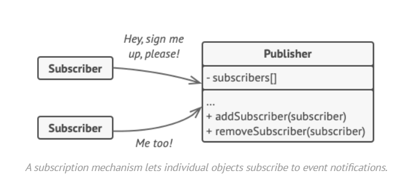
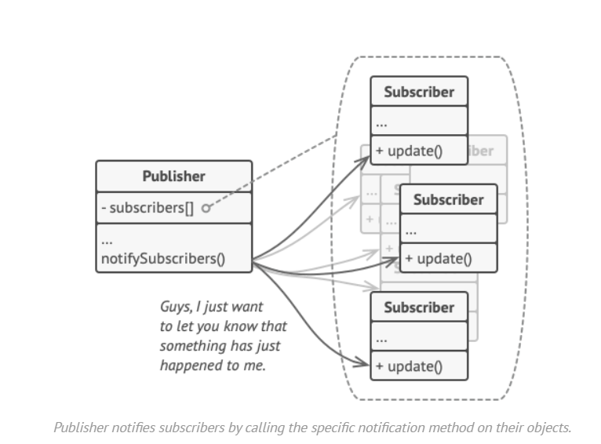
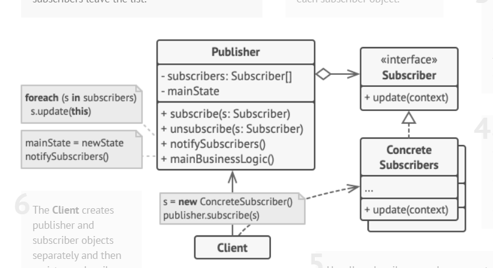
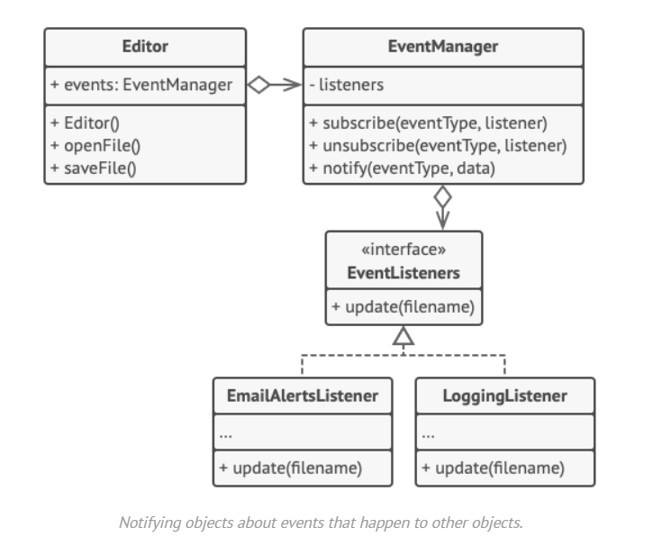
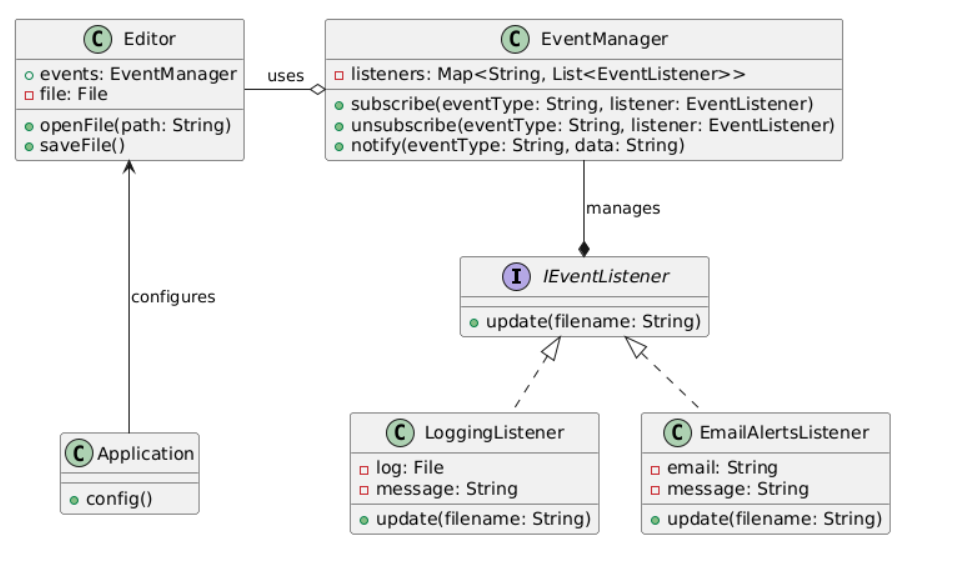

### **Problem**

- Customers repeatedly check a store for a product (e.g., a new iPhone) or the store spams all customers with updates, wasting time or resources.

### **Solution**

- Add a **subscription mechanism** where:
  - Interested customers (subscribers) get notified by the store (publisher) only when the product is available.

### **Terminology**

1. **Publisher**: The store, which tracks and notifies subscribers.
2. **Subscriber**: Customers interested in updates.
3. **Subscription Mechanism**: Allows adding/removing subscribers and sending updates.

### Why Use an Interface in the Observer Pattern

Without an interface, the publisher would need to interact with each subscriber’s specific implementation, causing tight coupling and making it hard to add new subscribers or modify existing ones. Using an interface ensures the publisher interacts with subscribers uniformly, avoiding direct coupling. This allows adding new subscribers without changing the publisher’s code and keeps the system flexible and maintainable.

go even further- make interface for the publishers if you have many in your app

If your programming language
supports functional types, you can replace the whole
subscriber hierarchy with a set of functions.

