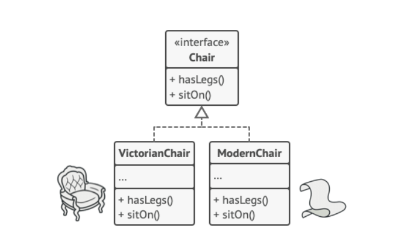
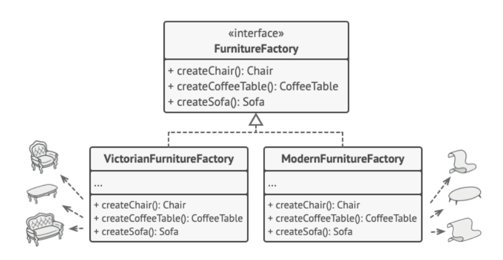
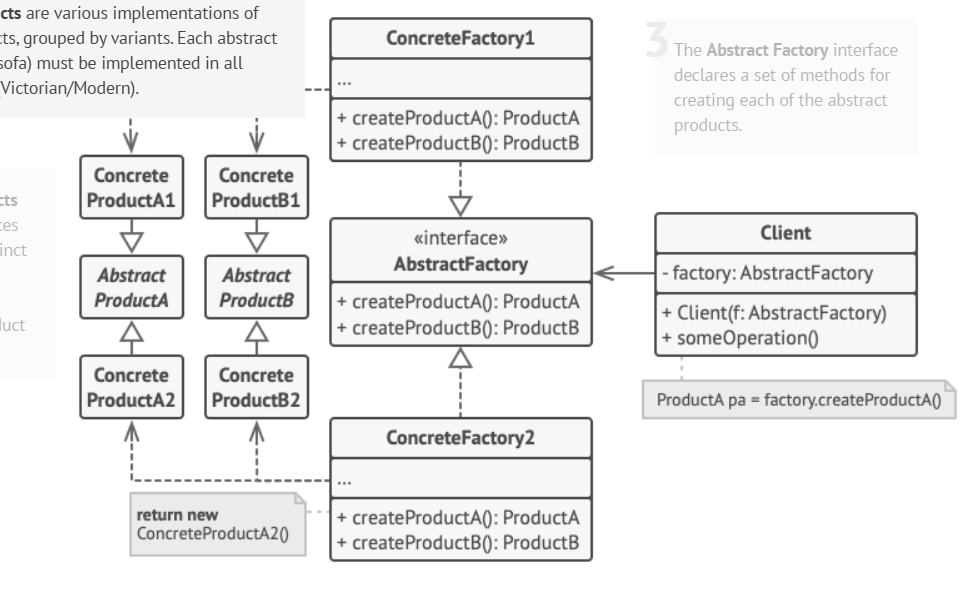
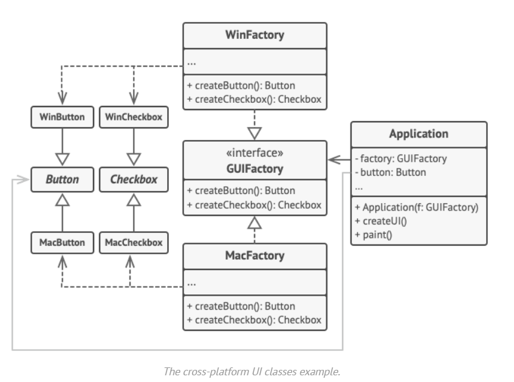
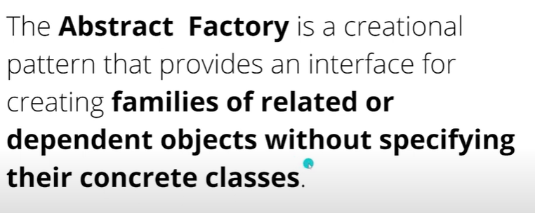
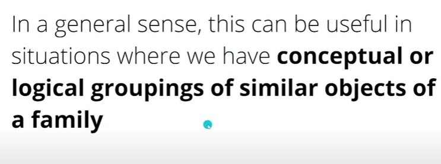
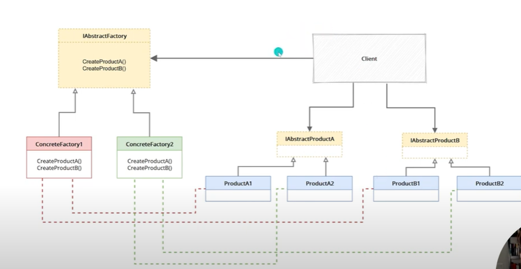
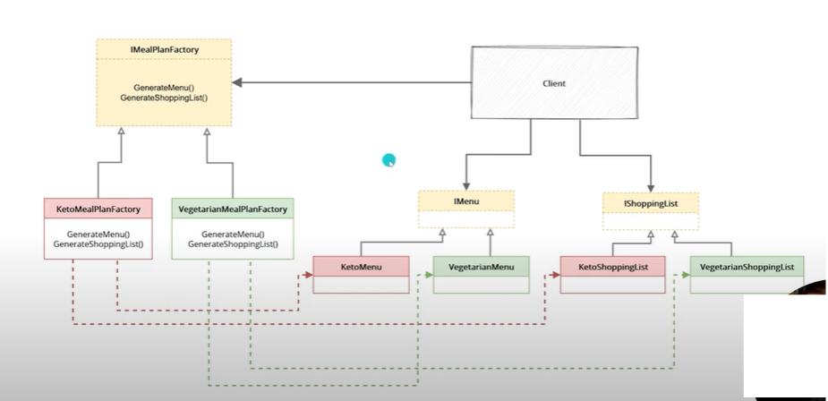
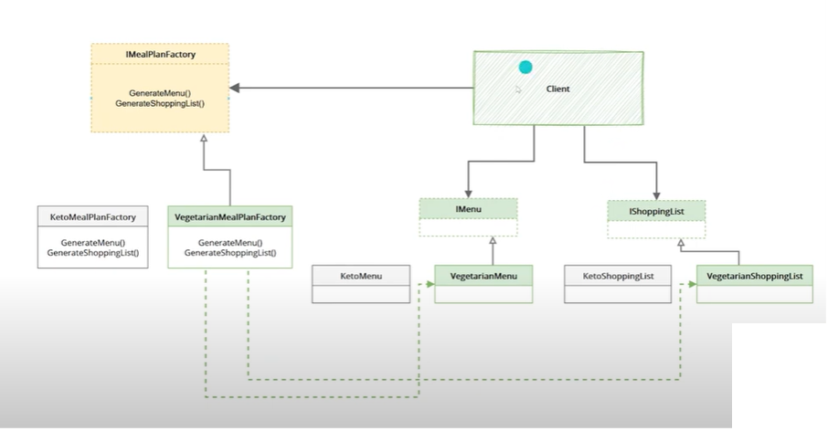

create interface for each distinct product

create abstractfactory that returns the distinct products interfaces

the client will have a factory that always give the same-family products

who/choosing the factory? Usually, the application creates a concrete factory object at the initialization stage. Just before that, the app must select the factory type depending on the configuration or the environment settings.

1. **Abstract Products:**

   - Define interfaces for related products that belong to a product family (e.g., `Chair`, `Sofa`).

2. **Concrete Products:**

   - Implement abstract products for specific variants (e.g., `VictorianChair`, `ModernChair`).

3. **Abstract Factory:**

   - Declares methods to create each product in the product family (e.g., `CreateChair()`, `CreateSofa()`).

4. **Concrete Factories:**

   - Implement the abstract factory methods to create specific product variants (e.g., `VictorianFactory`, `ModernFactory`).

5. **Client Code:**
   - Interacts only with abstract factories and abstract products.
   - Stays decoupled from specific product implementations and factories.

creating cross-platform UI elements without coupling the client code to concrete UI classes, while keeping all created elements consistent with a selected operating system.

family- related by theme or concept, created by same factory
product type- related by implementing same interface
products of the same family can collaborate

- more than factory method, it doent only decouple client code from creation, but manage also families of related products
- give dimention extensibility

particular motivation: families of objects

warning: introduces complexity!

### how to extend?

😊 adding new family- implement ConcreteFactory, implement ConcreteProduct\* num_products => interfaces & client unchanged

☹️ adding new product- create new I_Product, implement it \* num_families, update IAbstractFactory & ConcreteFactory \* num_families=> interfaces & client (can get new product now) changed!

we have a lot of classes, and adding new product would change many classes,

