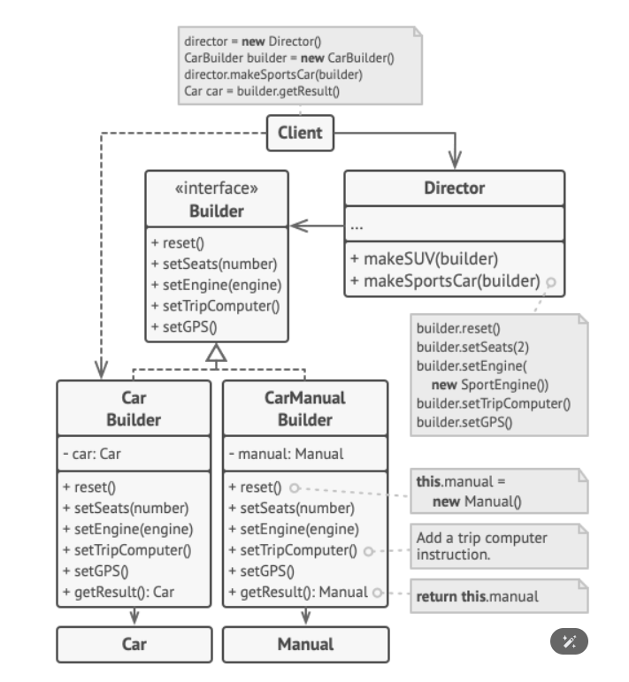

 1. extend the BaseHouse for every different house

 2. create ugly ctor

solution:
dedicated class for "building" logic

fluent syntax can be used to create fake objects for unit testing- with chaning set methods and implicit conversion

different builders implementation can give same object that was built in different ways, and can give 2 different objects, but than they can be retrieved only from the builders themselves, not from the director couse its not in the IBuilder

particular motivation: complex-to-create  objects

### how to extend? (same product different building logic)

1. **Create a New Builder:**
   - Implement `ITaskBuilder` or `IFluentTaskBuilder` for the new task type (e.g., `ResearchTaskBuilder`).

2. **Define Custom Build Logic:**
   - Override methods like `SetX()` and `BuildTask()` to set properties specific to the new task.

3. **Update the TaskDirector (Optional):**
   - Pass the new builder to `TaskDirector` if it needs to use the builder.

