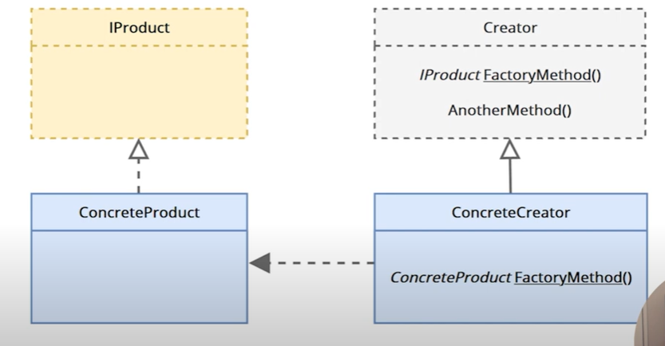
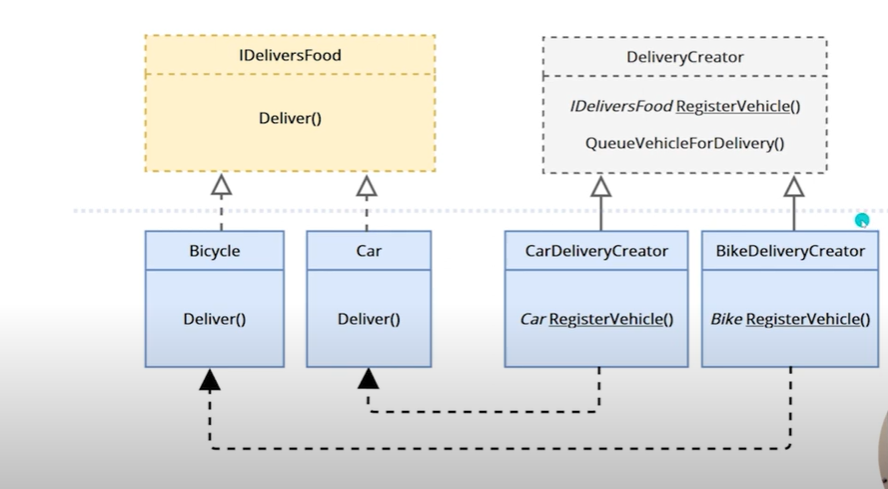
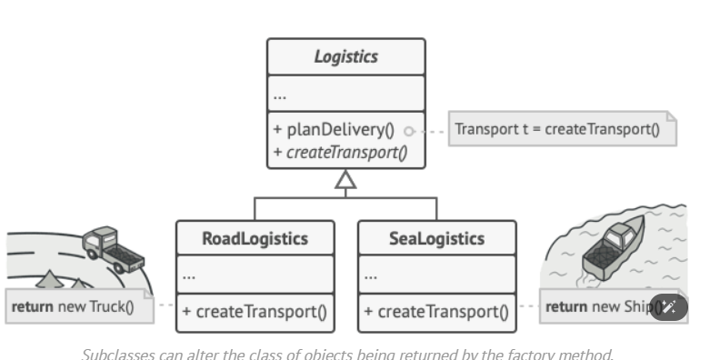
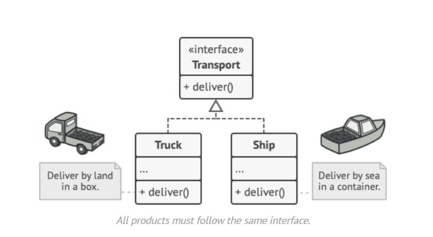
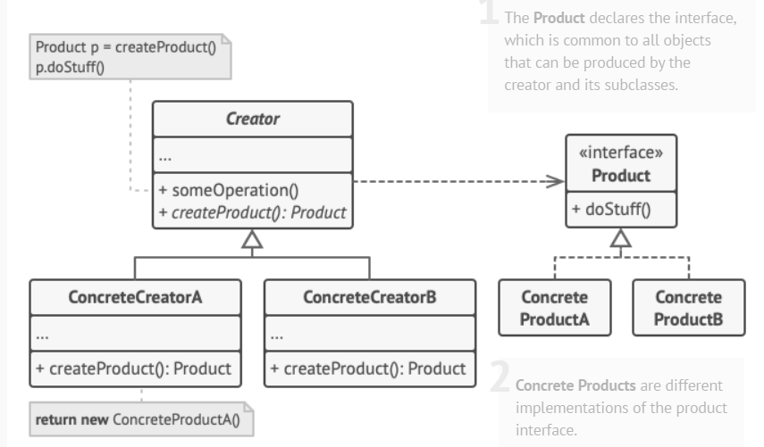
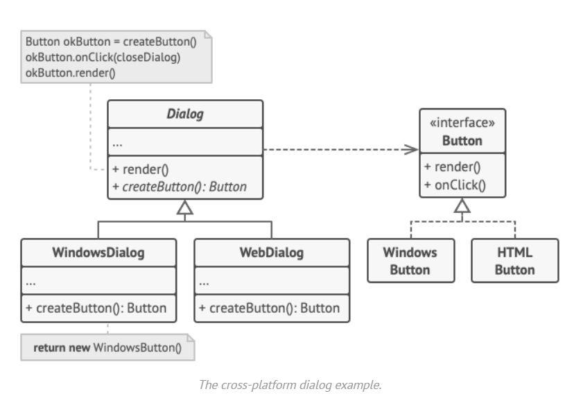
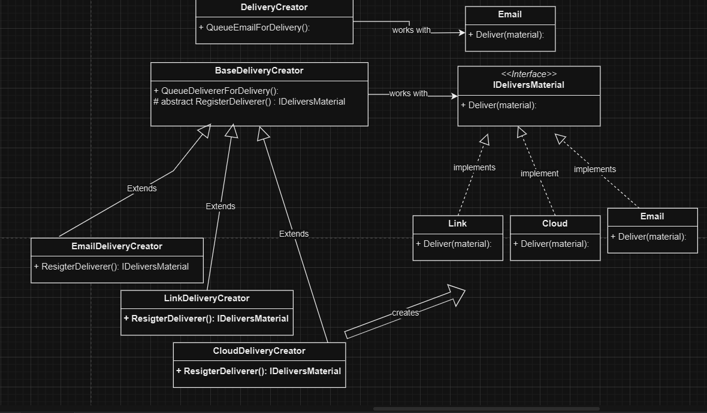

the client:
- choosing implementation:
    - chooses x way to deliver 
    - BaseDeliveryCreator  deliverByX = new xDeliveryCreator (choosing)
-----------------------
- relying on abstraction:
    - deliverByX.QueueDelivererForDelivery() 