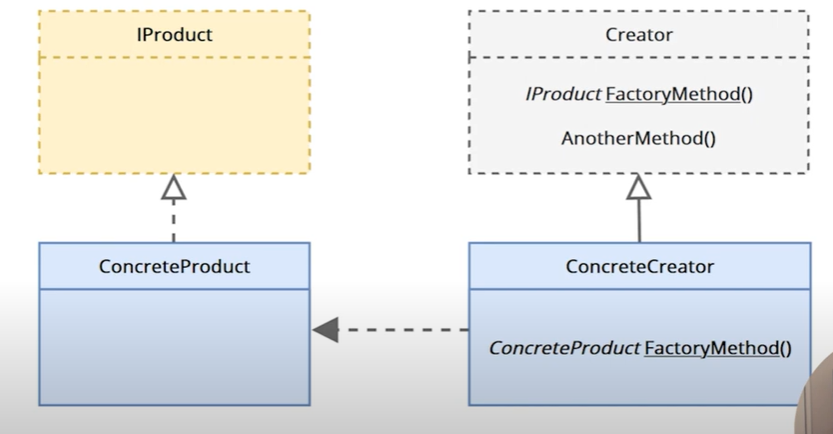
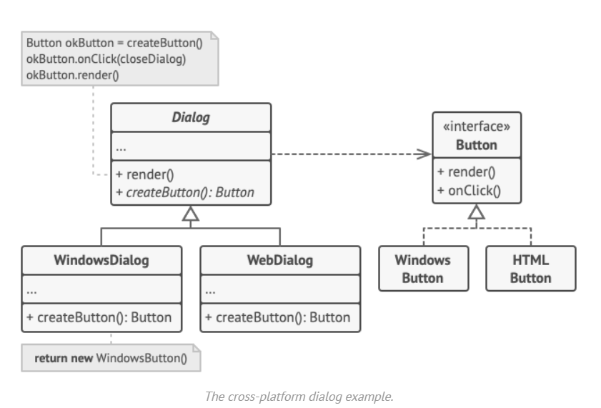
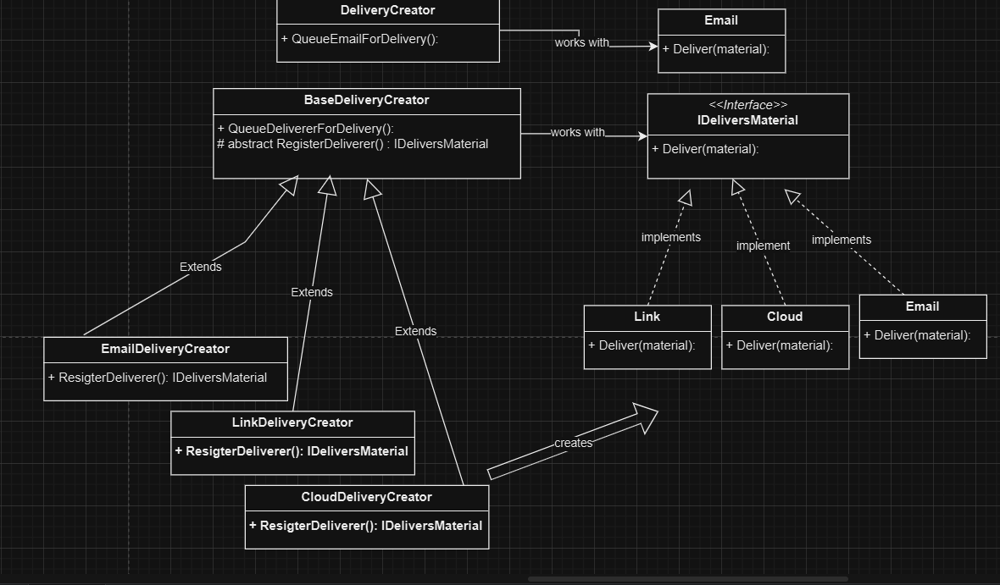

benefit: decouple client code from creation 

the client:
- choosing implementation:
    - chooses x way to deliver 
    - BaseDeliveryCreator  deliverByX = new xDeliveryCreator (choosing)
-----------------------
- relying on abstraction:
    - deliverByX.QueueDelivererForDelivery() 

### how to extend?

1. **Define a New Delivery Type:**
   - Create a new class (e.g., `SmsDelivery`) that implements the `IDeliversMaterial` interface.

2. **Create a New Creator:**
   - Extend `BaseDeliveryCreator` (e.g., `SmsDeliveryCreator`) and override the `RegisterDeliverer` method to return an instance of your new delivery type.

3. **Integrate the New Creator:**
   - Add it the the "choosing" logic , like the switch statement or map of type:object
