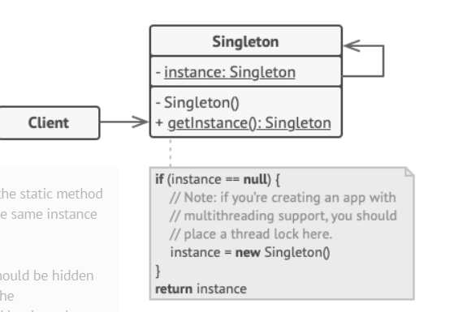
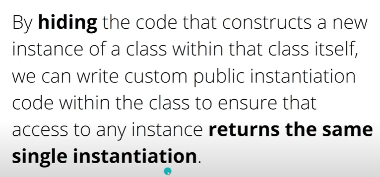

needs synchronization!

anti-pattern

- single, static access to a resource- thats gonna tightly couple us to that resource! 
- we can hide neferious logic there

this means private ctor, and static property to invoke that ctor

especially mutable global state
- methods that access it can change it methodA changes then mehtodB cannot make assertions about how the state is changed, its hard to make all the method collaborate, hard to test
- unit testing- static cling, we are tighed to that static property cannot test the clients without it, hard to mock
- not single responsibility: instantiation & business logic & global access point 
- we will do integration tests
- global (mutable) state- the number of connections is mutable, and the shared state make that we have no idea what is the mutable state 