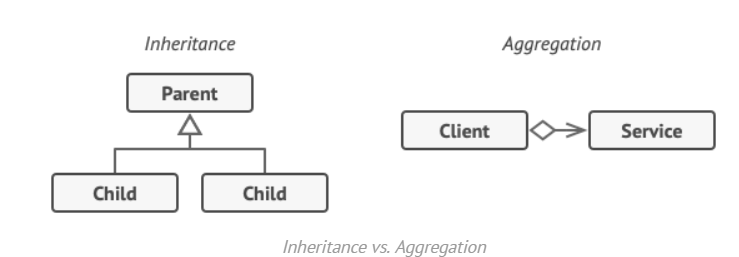

- **Core Component**: Single `Notifier` class for sending notifications.
- **Configuration**: Recipients' email list set during instantiation.
- **Functionality**: `send` method delivers messages to the configured emails.
- **Usage**: Third-party apps reuse a `Notifier` instance to send notifications.
- **Limitations**: Static configuration, email-only notifications, and no extensibility.


problem: want to add new behaviors of the notify


inheritance has several serious caveats that you need to be aware of.

- Inheritance is static. You can’t alter the behavior of an existing object at runtime. You can only replace the whole object with another one that’s created from a different subclass.
- Subclasses can have just one parent class. In most languages, inheritance doesn’t let a class inherit behaviors of multiple classes at the same time.



solution: use aggregation or composition over inheritance

- the wrapper implements the same interface as the wrapped object. That’s why from the client’s perspective these objects are identical
- Make the wrapper’s reference field accept any object that follows that interface


The client code would need to wrap a basic notifier object into a set of decorators that match the client’s preferences. The resulting objects will be structured as a stack.


### **Option 1: Simple Decorator Assembly**

```java
class Application {
    public static void main(String[] args) {
        DataSource source = new FileDataSource("somefile.dat");
        source = new CompressionDecorator(source);
        source = new EncryptionDecorator(source);

        source.writeData(salaryRecords); // Encrypted and compressed data written to file.
    }
}
```

---

### **Option 2: External Data Source with Configuration**

```java
class ApplicationConfigurator {
    public static void main(String[] args) {
        DataSource source = new FileDataSource("salary.dat");
        if (enabledEncryption) source = new EncryptionDecorator(source);
        if (enabledCompression) source = new CompressionDecorator(source);

        SalaryManager manager = new SalaryManager(source);
        manager.save(salaryRecords); // Save data using configured decorators.
    }
}
```

---

### **Key Points**:

- **Option 1** demonstrates a simple assembly of decorators.
- **Option 2** uses runtime conditions to configure the decorators dynamically.
